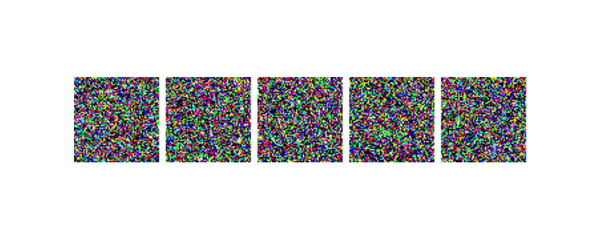
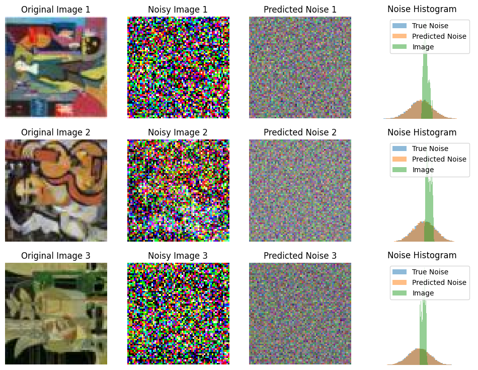
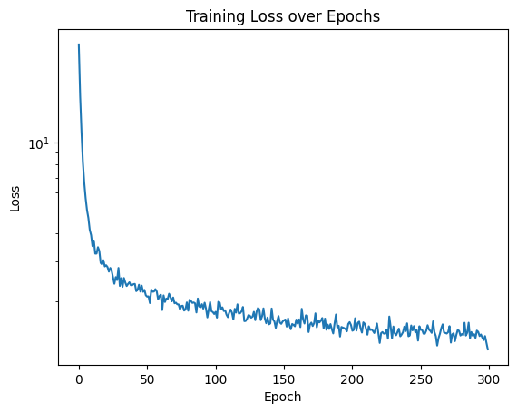

# Image diffusion

This notebook implements a **denoising diffusion probabilistic model** (DDPM) for **generating abstract art paintings**.

The noise prediction model is an attention UNet trained on 512 images of size 64x64. We split the data into 32 batches of 16 images each and train for 300 epochs using Adam optimizer with learning rate 1e-4. The denoising diffusion process uses 1000 timesteps.

When sampling random noise (there is no conditioning), the results looks as follows:

the .gif depicts 5 different samples that are stacked horizontally. In the following image we observe how the model learned to predict the noise

.

Finally a plot of the training loss over epochs is shown below:

The code for the UNet architecture is adapted from [here](https://docs.kidger.site/equinox/examples/unet/). We use [Equinox](https://docs.kidger.site/equinox/) as the neural network library, [Optax](https://optax.readthedocs.io/en/latest/) for optimization, and [JAX](https://jax.readthedocs.io/en/latest/) for automatic differentiation. The training takes around 10 minutes on a laptop with a NVIDIA RTX 4070 GPU 8 GB VRAM.